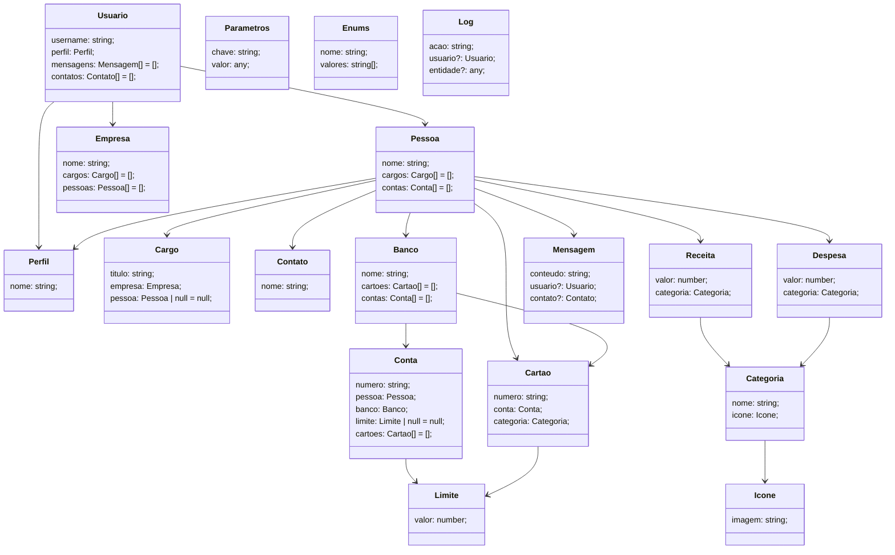

# Diagrama

## Classes

Empresa,Cargo,Pessoa,Banco,Cartao,Conta,Categoria,Limite,Receita,Despesa,Mensagem,Icone,Contato,Usuario,Perfil,Parametros,Enums,Log

## Relacionamento

```mermaid
classDiagram

Usuario --> Perfil
Usuario --> Pessoa
Usuario --> Empresa

Pessoa --> Cargo
Pessoa --> Contato
Pessoa --> Perfil
Pessoa --> Cartao
Pessoa --> Receita
Pessoa --> Despesa
Pessoa --> Mensagem
Pessoa --> Banco


Banco --> Conta
Banco --> Cartao

Conta --> Limite
Cartao --> Limite

Receita --> Categoria
Despesa --> Categoria

Categoria --> Icone

class Empresa {
    nome: string;
    cargos: Cargo[] = [];
    pessoas: Pessoa[] = [];
}

class Cargo {
    titulo: string;
    empresa: Empresa;
    pessoa: Pessoa | null = null;
}

class Pessoa {
    nome: string;
    cargos: Cargo[] = [];
    contas: Conta[] = [];
}

class Banco {
    nome: string;
    cartoes: Cartao[] = [];
    contas: Conta[] = [];
}

class Cartao {
    numero: string;
    conta: Conta;
    categoria: Categoria;
}

class Conta {
    numero: string;
    pessoa: Pessoa;
    banco: Banco;
    limite: Limite | null = null;
    cartoes: Cartao[] = [];
}

class Categoria {
    nome: string;
    icone: Icone;
}

class Limite {
    valor: number;
}

class Receita {
    valor: number;
    categoria: Categoria;
}

class Despesa {
    valor: number;
    categoria: Categoria;
}

class Mensagem {
    conteudo: string;
    usuario?: Usuario;
    contato?: Contato;
}

class Icone {
    imagem: string;
}

class Contato {
    nome: string;
}

class Usuario {
    username: string;
    perfil: Perfil;
    mensagens: Mensagem[] = [];
    contatos: Contato[] = [];
}

class Perfil {
    nome: string;
}

class Parametros {
    chave: string;
    valor: any;
}

class Enums {
    nome: string;
    valores: string[];
}

class Log {
    acao: string;
    usuario?: Usuario;
    entidade?: any;
}

```
