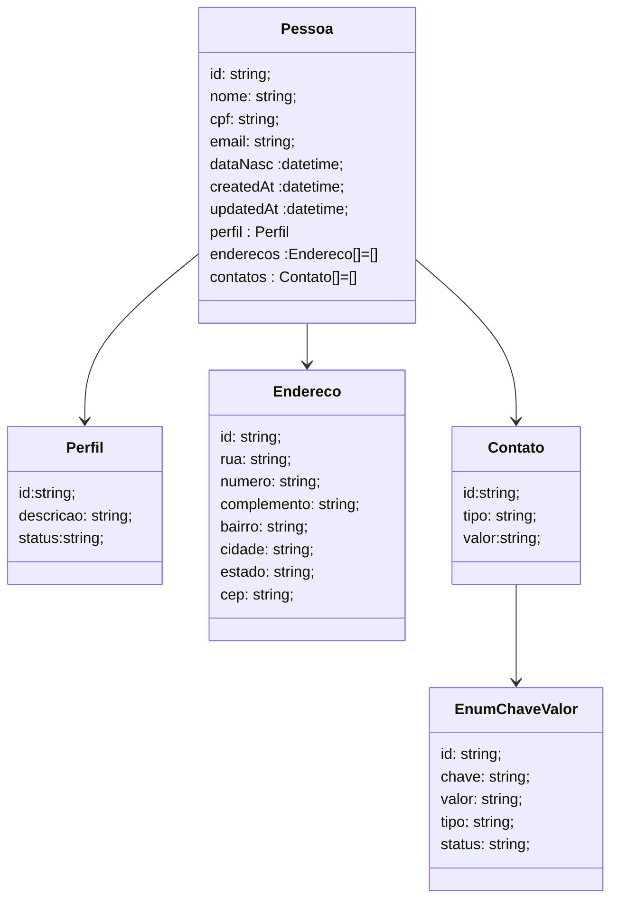

# Diagrama

## Relacionamento

```mermaid
classDiagram


Pessoa --> Perfil
Pessoa --> Endereco
Pessoa --> Contato
Contato --> EnumChaveValor

class Pessoa {
    id: string;
    nome: string;
    cpf: string;
    email: string;
    dataNasc :datetime;
    createdAt :datetime;
    updatedAt :datetime;
    perfil : Perfil
    enderecos :Endereco[]=[]
    contatos : Contato[]=[]
}

class Perfil{
   id:string;
   descricao: string;
   status:string;
}

class Endereco {
    id: string;
    rua: string;
    numero: string;
    complemento: string;
    bairro: string;
    cidade: string;
    estado: string;
    cep: string;
}

class Contato{
   id:string;
   tipo: string;
   valor:string;
}

class EnumChaveValor{
    id: string;
    chave: string;
    valor: string;
    tipo: string;
    status: string;
}

```
