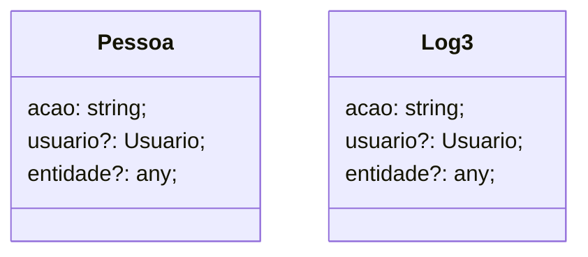

# Diagrama

## Relacionamento

```mermaid
classDiagram


class Pessoa {
    acao: string;
    usuario?: Usuario;
    entidade?: any;
}


class Log3 {
    acao: string;
    usuario?: Usuario;
    entidade?: any;
}

```
