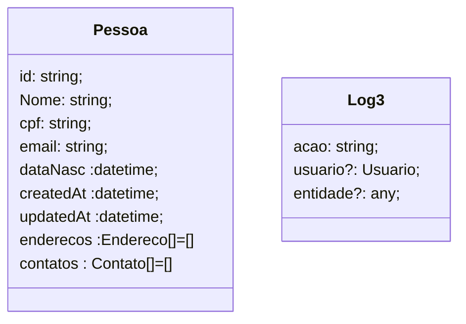

# Diagrama

## Relacionamento

```mermaid
classDiagram


class Pessoa {
    id: string;
    Nome: string;
    cpf: string;
    email: string;
    dataNasc :datetime;
    createdAt :datetime;
    updatedAt :datetime;
    enderecos :Endereco[]=[]
    contatos : Contato[]=[]
}


class Log3 {
    acao: string;
    usuario?: Usuario;
    entidade?: any;
}

```
