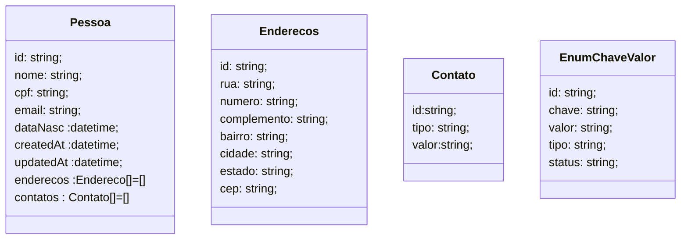

# Diagrama

## Relacionamento

```mermaid
classDiagram


class Pessoa {
    id: string;
    nome: string;
    cpf: string;
    email: string;
    dataNasc :datetime;
    createdAt :datetime;
    updatedAt :datetime;
    enderecos :Endereco[]=[]
    contatos : Contato[]=[]
}


class Enderecos {
    id: string;
    rua: string;
    numero: string;
    complemento: string;
    bairro: string;
    cidade: string;
    estado: string;
    cep: string;
}
class Contato{
   id:string;
   tipo: string;
   valor:string;
}

class EnumChaveValor{
    id: string;
    chave: string;
    valor: string;
    tipo: string;
    status: string;
}

```
